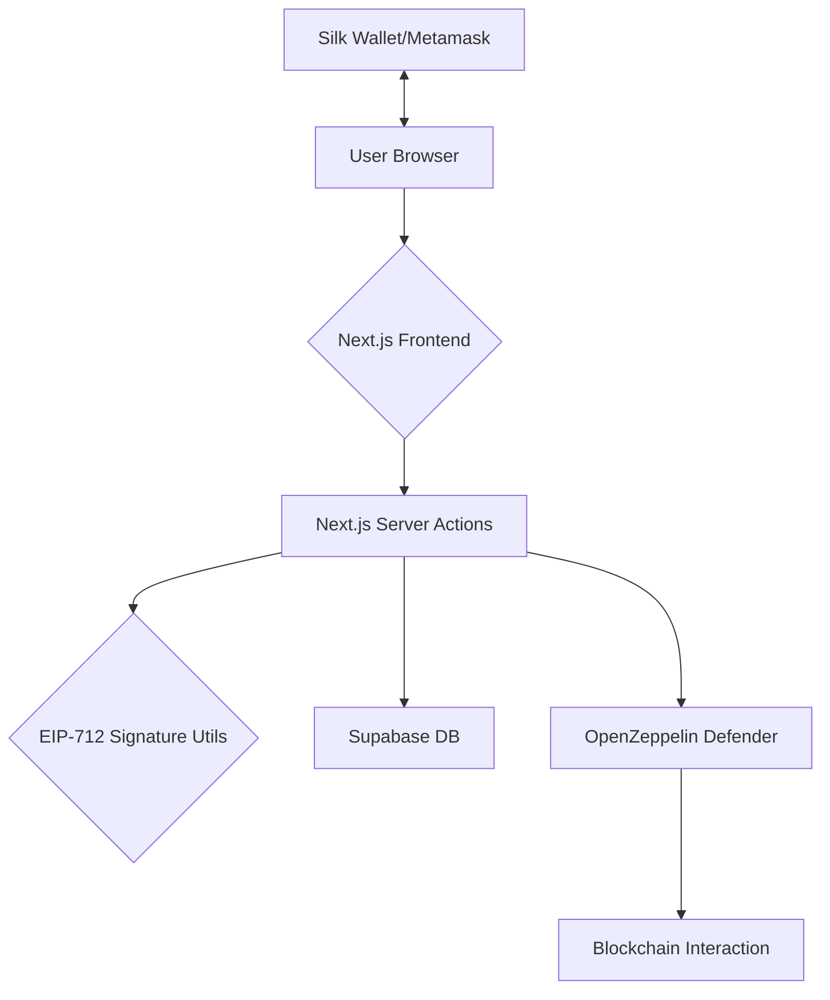
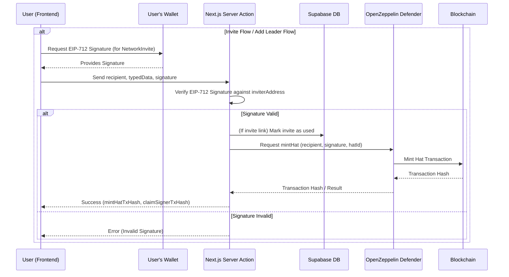

# Refunite Network Onboarding

A Next.js application facilitating a secure and streamlined onboarding process for new members into the Refunite network. It leverages EIP-712 signed typed data for enhanced security and user experience during critical operations like inviting new users and adding leaders.

## Table of Contents

- [Refunite Network Onboarding](#refunite-network-onboarding)
  - [Table of Contents](#table-of-contents)
  - [Architecture Overview](#architecture-overview)
  - [Key Features](#key-features)
  - [Core Technologies](#core-technologies)
  - [Onboarding Flow](#onboarding-flow)
    - [EIP-712 Signatures](#eip-712-signatures)
  - [Server Actions](#server-actions)
  - [Getting Started](#getting-started)
    - [Prerequisites](#prerequisites)
    - [Installation](#installation)
    - [Running the Development Server](#running-the-development-server)
  - [Environment Variables](#environment-variables)
  - [Local database](#local-database)
  - [Database Schema](#database-schema)
  - [Turso](#turso)
  - [Defender Integration](#defender-integration)
  - [BigInt Serialization/Deserialization](#bigint-serializationdeserialization)
  - [Troubleshooting](#troubleshooting)
  - [Contributing](#contributing)
  - [License](#license)

## Architecture Overview

The application is built with Next.js, utilizing its App Router for routing and React Server Components for efficient rendering. Server Actions are employed for handling backend logic directly within React components, eliminating the need for traditional API routes for internal operations. Supabase serves as the backend database for storing invite data, and OpenZeppelin Defender is used for secure transaction relaying (e.g., minting Hats).



## Key Features

- **Role Management**: Community leaders receive on-chain credentials through the [Hats Protocol](https://www.hatsprotocol.xyz/) to attest to their roles.
- **Decentralized Trust Network**: No central control over the state; managed entirely by leaders themselves.
- **Scalability**: Designed to support up to 100,000 leaders, grouped by geographic or other predefined subsets.
- **Secure Onboarding**: Utilizes EIP-712 typed data signatures for inviting and adding new leaders, ensuring clarity and security for signers.

## Core Technologies

- **Next.js**: React framework for building the user interface and handling server-side logic with Server Actions.
- **EIP-712**: Standard for typed structured data signing, enhancing security and UX for wallet interactions.
- **Viem**: TypeScript interface for Ethereum, used for wallet interactions and cryptographic operations.
- **Supabase**: Backend-as-a-Service for database storage (PostgreSQL) and authentication.
- **OpenZeppelin Defender**: Platform for secure smart contract operations, including transaction relaying.
- **Hats Protocol**: For on-chain role management and attestations.
- **Silk Wallet / MetaMask**: User wallets for interacting with the application and signing transactions/messages.
- **Tailwind CSS & shadcn/ui**: For styling and UI components.

## Onboarding Flow

The onboarding process involves either an existing leader inviting a new user or directly adding a new leader. Both flows leverage EIP-712 signed typed data for secure interactions.

### EIP-712 Signatures

To enhance security and provide a better user experience, the application uses EIP-712 for signing messages. This standard allows for structured, human-readable data to be presented to the user when they are asked to sign a message with their wallet (e.g., Silk Wallet or MetaMask).

The core components of an EIP-712 signature in this application are:

- **Domain Separator**: Defines the context of the signature (e.g., application name, version, chain ID, verifying contract).
- **Typed Data**: The actual message being signed, structured with clear field names and types.

When a leader initiates an invite or adds another leader:

1. The frontend constructs the EIP-712 typed data (`NetworkInvite`).
2. The leader signs this typed data using their connected wallet.
3. The signature, along with the typed data, is sent to a Server Action.
4. The Server Action verifies the signature against the provided data and the inviter's address using `viem` utility functions.
5. If valid, the action proceeds (e.g., stores the invite in Supabase or calls Defender to mint a Hat).

**Typed Data Format (`NetworkInvite`)**

```typescript
const types = {
  NetworkInvite: [
    { name: "content", type: "string" },
    { name: "inviterAddress", type: "address" },
    { name: "nonce", type: "string" },
    { name: "createdAt", type: "uint256" },
  ],
};

// Example message structure
const message = {
  content: "I authorize this invite to be created for the RelayID Network.",
  inviterAddress: "0xCD2a3d9F938E13CD947Ec05AbC7FE734Df8DD826",
  nonce: "a1b2c3d4e5f67890",
  createdAt: 1678886400n, // Unix timestamp as BigInt
};
```

This structured data is what the user sees and approves in their wallet, ensuring they understand what they are authorizing.



## Server Actions

This project utilizes Next.js Server Actions to handle backend logic and data mutations. Server Actions are functions that run on the server but can be called directly from React Server Components or Client Components.

Key Server Actions in this project:

1. **`src/app/actions/invite.ts`**: Handles invite creation, verification, and retrieval

   - `createInvite`: Creates a new invite with EIP-712 signed data
   - `verifyInvite`: Checks if an invite code is valid and unused
   - `getInviteByCode`: Retrieves invite data by code

2. **`src/app/actions/defender.ts`**: Handles blockchain interactions through Defender
   - `addLeaderViaSignedTypedData`: Processes verified signatures to add new leaders via the Hats Protocol

These actions provide a streamlined way to handle server-side operations without creating separate API routes.

## Getting Started

### Prerequisites

- [Node.js](https://nodejs.org/) (v18 or later)
- [pnpm](https://pnpm.io/installation)
- [Supabase Account](https://supabase.com/) (for managing onboarding invites)
- [OpenZeppelin Defender Account](https://defender.openzeppelin.com/) (for blockchain interactions)

### Installation

1. Clone the repository:
2. Install dependencies:

   ```bash
   pnpm install
   ```

3. Set up environment variables:
   Copy the `.env.example` file to `.env.local` and fill in the required values.

   ```bash
   cp .env.example .env.local
   ```

4. Update the `.env.local` file with your own values:

   ```
   # Turso
   TURSO_DATABASE_URL="file:local.db" -> replace this with a staging or prod deployment url
   TURSO_AUTH_TOKEN=

   # Defender
   DEFENDER_WEBHOOK_URL=your_defender_webhook_url

   # Hats Protocol
   NEXT_PUBLIC_HATS_TREE_ID=your_hats_tree_id
   NEXT_PUBLIC_HATS_LEADER_ID=your_leader_hat_id
   NEXT_PUBLIC_HATS_LEADER_SAFE_ACCOUNT=your_leader_safe_address

   # Chain
   NEXT_PUBLIC_CHAIN_ID=10 # Optimism
   ```

### Running the Development Server

```bash
pnpm dev
```

Open [http://localhost:3000](http://localhost:3000) in your browser.

## Environment Variables

Required environment variables:

| Variable                               | Description                              | Public? |
| -------------------------------------- | ---------------------------------------- | ------- |
| `DEFENDER_WEBHOOK_URL`                 | OpenZeppelin Defender webhook URL        | No      |
| `NEXT_PUBLIC_HATS_TREE_ID`             | Hats Protocol tree ID                    | Yes     |
| `NEXT_PUBLIC_HATS_LEADER_ID`           | Leader hat ID in Hats Protocol           | Yes     |
| `NEXT_PUBLIC_HATS_LEADER_SAFE_ACCOUNT` | Safe account address for leaders         | Yes     |
| `NEXT_PUBLIC_CHAIN_ID`                 | Blockchain network chain ID              | Yes     |
| `TURSO_DATABASE_URL`                   | URL to Turso instance                    | No      |
| `TURSO_AUTH_TOKEN`                     | Token to connect to Turso Cloud instance | No      |

**Important**: `NEXT_PUBLIC_` variables are exposed to the browser. Do not store sensitive secrets with this prefix.

## Local database

Following the [local developement guide](https://docs.turso.tech/local-development):

- `turso db shell staging-db .dump > dump.sql`
- `cat dump.sql | sqlite3 local.db`

## Database Schema

The application uses Supabase (PostgreSQL) for data storage. The main table is `invites`, created by running `dump.ql`

The table also has:

- An index on `inviter_signature` for faster lookups

## Turso

We maintain two databases:

- `relay-id-tst`
- `relay-id-prd`

## Defender Integration

This application uses OpenZeppelin Defender to securely interact with smart contracts:

1. **Create a Defender Relayer**: Set up a relayer in Defender for your target network (e.g., Optimism).
2. **Create a Defender Autotask**: This will be triggered by a webhook to execute the smart contract interactions (e.g., minting a Hat).
3. **Configure the Webhook**: The Autotask should expose a webhook URL which you'll set as `DEFENDER_WEBHOOK_URL` in your environment variables.

The `addLeaderViaSignedTypedData` server action in `src/app/actions/defender.ts` handles sending the request to Defender, which then executes the blockchain transaction.

## BigInt Serialization/Deserialization

JavaScript cannot natively serialize `BigInt` values to JSON. The utility functions in `src/lib/utils/serialize.ts` handle this conversion for storage and retrieval:

```typescript
// When storing data with BigInt values
const serializableData = serializeBigInts(dataWithBigInts);

// When retrieving stored data
const dataWithBigInts = deserializeBigInts(retrievedData);
```

These utilities are used automatically in the server actions when handling typed data.

## Troubleshooting

Common issues and solutions:

1. **Invalid EIP-712 Signature**

   - Ensure the wallet is connected to the correct network (check CHAIN_ID)
   - Verify the inviter has proper permissions to create invites

2. **Defender Webhook Errors**

   - Check Defender Relayer has sufficient funds for gas
   - Verify the Autotask is properly configured with the correct contract ABI

3. **Database Access Issues**
   - Ensure Supabase service key has proper permissions
   - Check Row Level Security policies

## Contributing

Contributions to the Refunite Network are welcome! To contribute:

1. Fork the repository
2. Create a feature branch (`git checkout -b feature/amazing-feature`)
3. Make your changes (following the code style of the project)
4. Commit your changes (`git commit -m 'Add some amazing feature'`)
5. Push to the branch (`git push origin feature/amazing-feature`)
6. Open a Pull Request

Please make sure to update tests as appropriate and follow the existing code style.

## License

This project is licensed under the MIT License.
