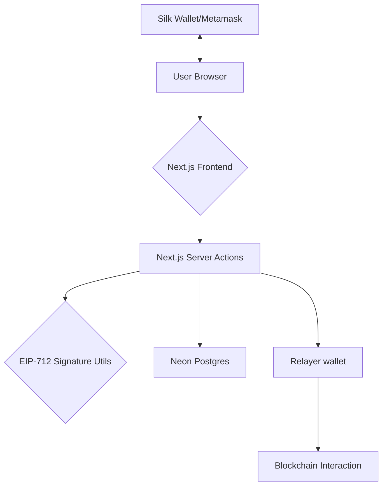
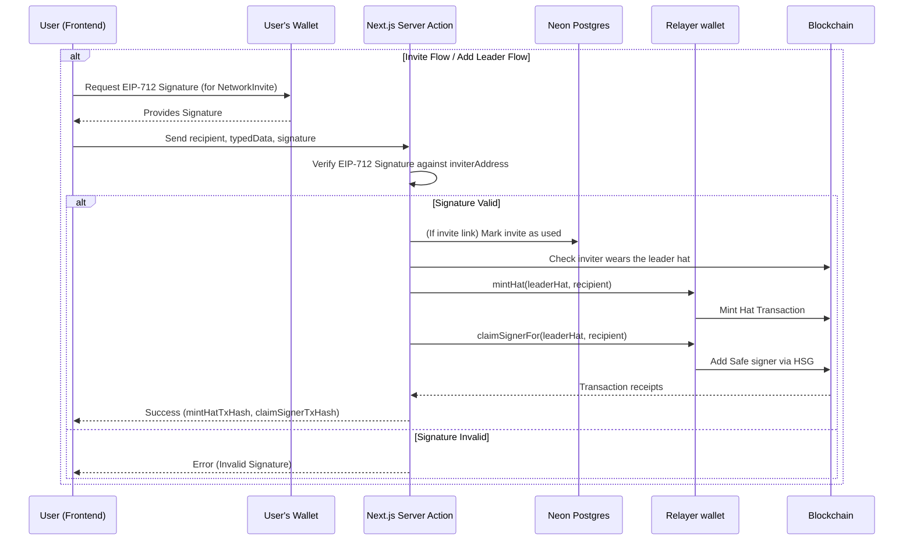

# Refunite Network Onboarding

A Next.js application facilitating a secure and streamlined onboarding process for new members into the Refunite network. It leverages EIP-712 signed typed data for enhanced security and user experience during critical operations like inviting new users and adding leaders.

## Table of Contents

- [Refunite Network Onboarding](#refunite-network-onboarding)
  - [Table of Contents](#table-of-contents)
  - [Architecture Overview](#architecture-overview)
  - [Key Features](#key-features)
  - [Core Technologies](#core-technologies)
  - [Onboarding Flow](#onboarding-flow)
    - [EIP-712 Signatures](#eip-712-signatures)
  - [Server Actions](#server-actions)
  - [Getting Started](#getting-started)
    - [Prerequisites](#prerequisites)
    - [Installation](#installation)
    - [Running the Development Server](#running-the-development-server)
  - [Environment Variables](#environment-variables)
  - [Local database](#local-database)
  - [Database Schema](#database-schema)
  - [Onboarding Relayer](#onboarding-relayer)
  - [BigInt Serialization/Deserialization](#bigint-serializationdeserialization)
  - [Native mobile app development](#native-mobile-app-development)
  - [Troubleshooting](#troubleshooting)
  - [Contributing](#contributing)
  - [License](#license)

## Architecture Overview

The application is built with Next.js, utilizing its App Router for routing and React Server Components for efficient rendering. Server Actions are employed for handling backend logic directly within React components, eliminating the need for traditional API routes for internal operations. Neon (Postgres, accessed through Drizzle ORM) stores invite and onboarding data, and a server-side relayer wallet sends the onboarding transactions (minting Hats and adding Safe signers).



## Key Features

- **Role Management**: Community leaders receive on-chain credentials through the [Hats Protocol](https://www.hatsprotocol.xyz/) to attest to their roles.
- **Decentralized Trust Network**: No central control over the state; managed entirely by leaders themselves.
- **Scalability**: Designed to support up to 100,000 leaders, grouped by geographic or other predefined subsets.
- **Secure Onboarding**: Utilizes EIP-712 typed data signatures for inviting and adding new leaders, ensuring clarity and security for signers.

## Core Technologies

- **Next.js**: React framework for building the user interface and handling server-side logic with Server Actions.
- **EIP-712**: Standard for typed structured data signing, enhancing security and UX for wallet interactions.
- **Viem**: TypeScript interface for Ethereum, used for wallet interactions and cryptographic operations.
- **Neon + Drizzle**: Serverless Postgres, with a typed schema and committed migrations.
- **Relayer wallet**: Server-held key that pays gas for onboarding transactions.
- **Hats Protocol**: For on-chain role management and attestations.
- **Silk Wallet / MetaMask**: User wallets for interacting with the application and signing transactions/messages.
- **Tailwind CSS & shadcn/ui**: For styling and UI components.

## Onboarding Flow

The onboarding process involves either an existing leader inviting a new user or directly adding a new leader. Both flows leverage EIP-712 signed typed data for secure interactions.

### EIP-712 Signatures

To enhance security and provide a better user experience, the application uses EIP-712 for signing messages. This standard allows for structured, human-readable data to be presented to the user when they are asked to sign a message with their wallet (e.g., Silk Wallet or MetaMask).

The core components of an EIP-712 signature in this application are:

- **Domain Separator**: Defines the context of the signature (e.g., application name, version, chain ID, verifying contract).
- **Typed Data**: The actual message being signed, structured with clear field names and types.

When a leader initiates an invite or adds another leader:

1. The frontend constructs the EIP-712 typed data (`NetworkInvite`).
2. The leader signs this typed data using their connected wallet.
3. The signature, along with the typed data, is sent to a Server Action.
4. The Server Action verifies the signature against the provided data and the inviter's address using `viem` utility functions.
5. If valid, the action proceeds (e.g., stores the invite or has the relayer mint a Hat).

**Typed Data Format (`NetworkInvite`)**

```typescript
const types = {
  NetworkInvite: [
    { name: "content", type: "string" },
    { name: "inviterAddress", type: "address" },
    { name: "nonce", type: "string" },
    { name: "createdAt", type: "uint256" },
  ],
};

// Example message structure
const message = {
  content: "I authorize this invite to be created for the RelayID Network.",
  inviterAddress: "0xCD2a3d9F938E13CD947Ec05AbC7FE734Df8DD826",
  nonce: "a1b2c3d4e5f67890",
  createdAt: 1678886400n, // Unix timestamp as BigInt
};
```

This structured data is what the user sees and approves in their wallet, ensuring they understand what they are authorizing.



## Server Actions

This project utilizes Next.js Server Actions to handle backend logic and data mutations. Server Actions are functions that run on the server but can be called directly from React Server Components or Client Components.

Key Server Actions in this project:

1. **`src/app/actions/invite.ts`**: Handles invite creation, verification, and retrieval

   - `createInvite`: Creates a new invite with EIP-712 signed data
   - `verifyInvite`: Checks if an invite code is valid and unused
   - `getInviteByCode`: Retrieves invite data by code

2. **`src/app/actions/onboard.ts`**: Handles onboarding through the relayer (`src/lib/relayer`)
   - `addLeaderViaSignedTypedData`: Processes verified signatures to add new leaders via the Hats Protocol

These actions provide a streamlined way to handle server-side operations without creating separate API routes.

## Getting Started

### Prerequisites

- [Node.js](https://nodejs.org/) (v18 or later)
- [pnpm](https://pnpm.io/installation)
- A [Neon](https://neon.tech/) Postgres database (for onboarding data)
- A relayer wallet that wears an admin hat of the leader hat (see [Onboarding Relayer](#onboarding-relayer))

### Installation

1. Clone the repository:
2. Install dependencies:

   ```bash
   pnpm install
   ```

3. Set up environment variables:
   Copy the `.env.example` file to `.env.local` and fill in the required values.

   ```bash
   cp .env.example .env.local
   ```

4. Update the `.env.local` file with your own values:

   ```
   # Database (Neon Postgres connection string)
   DATABASE_URL=postgresql://...

   # Relayer
   RELAYER_PRIVATE_KEY=your_relayer_private_key
   NEXT_PUBLIC_HSG_CONTRACT_ADDRESS=your_hsg_address

   # Hats Protocol
   NEXT_PUBLIC_HATS_TREE_ID=your_hats_tree_id
   NEXT_PUBLIC_HATS_LEADER_ID=your_leader_hat_id
   NEXT_PUBLIC_HATS_LEADER_SAFE_ACCOUNT=your_leader_safe_address

   # Chain
   NEXT_PUBLIC_DEFAULT_CHAIN=sepolia # or celo
   NEXT_PUBLIC_CHAIN_ID=11155111 # or 42220
   ```

### Running the Development Server

```bash
pnpm dev
```

Open [http://localhost:3000](http://localhost:3000) in your browser.

## Environment Variables

See `.env.example` for the full list, split into required and optional. The main ones:

| Variable                               | Description                              | Public? |
| -------------------------------------- | ---------------------------------------- | ------- |
| `RELAYER_PRIVATE_KEY`                  | Relayer wallet private key               | No      |
| `NEXT_PUBLIC_HSG_CONTRACT_ADDRESS`     | Hats Signer Gate for the leaders' Safe   | Yes     |
| `NEXT_PUBLIC_HATS_TREE_ID`             | Hats Protocol tree ID                    | Yes     |
| `NEXT_PUBLIC_HATS_LEADER_ID`           | Leader hat ID in Hats Protocol           | Yes     |
| `NEXT_PUBLIC_HATS_LEADER_SAFE_ACCOUNT` | Safe account address for leaders         | Yes     |
| `NEXT_PUBLIC_CHAIN_ID`                 | Blockchain network chain ID              | Yes     |
| `DATABASE_URL`                         | Neon Postgres connection string          | No      |

**Important**: `NEXT_PUBLIC_` variables are exposed to the browser. Do not store sensitive secrets with this prefix.

## Database

Data lives in Postgres ([Neon](https://neon.tech/)), accessed through [Drizzle ORM](https://orm.drizzle.team/):

- Schema: `src/lib/db/schema.ts`
- Client: `src/lib/db/index.ts` (Neon serverless HTTP driver)
- Queries: `src/lib/database/service.ts` (`DB.*`)
- Migrations: `drizzle/`, generated from the schema and committed

Tables: `invitations`, `reservations`, `completions`, `security_events` and `audit_log`.

```bash
pnpm db:generate   # after changing schema.ts: write a new migration into drizzle/
pnpm db:migrate    # apply pending migrations to DATABASE_URL
pnpm db:studio     # browse the database
```

Run `pnpm db:migrate` against each environment's database before deploying code that needs a new migration. The database tests (`test/lib/database.test.ts`) run the migrations against an in-memory Postgres (PGlite), so they need no database.

## Onboarding Relayer

Onboarding used to run through an OpenZeppelin Defender Action. Defender shut down on 2026-07-01, so the app now sends the transactions itself from a relayer wallet (`src/lib/relayer`).

For each onboarding, `addLeaderViaSignedTypedData` in `src/app/actions/onboard.ts`:

1. Checks the inviter currently wears the leader hat.
2. Verifies the EIP-712 signature and reserves the invite (`src/lib/onboarding/reservations.ts`).
3. Sends `Hats.mintHat(leaderHat, recipient)` from the relayer and waits for the receipt.
4. Sends `HSG.claimSignerFor(leaderHat, recipient)` to add the recipient as a Safe signer.
5. Confirms the reservation, or rolls it back if a transaction fails.

Setting up a relayer for a chain:

1. Create a new wallet and set its private key as `RELAYER_PRIVATE_KEY` (server-only; mark it sensitive in Vercel).
2. Fund it with native gas (CELO on Celo, ETH on Sepolia).
3. From the top hat, give the wallet an admin hat of the leader hat, e.g. `Hats.transferHat` of the level-1 hat from the old relayer, or `Hats.mintHat` of an unused admin hat.

The admin dashboard shows the relayer address and balance.

### Test setup on Sepolia

`scripts/setup-test-hats.ts` creates a Hats tree you control, shaped like production, plus a new Safe and Hats Signer Gate (v2), so you can test onboarding without access to an existing top hat:

It mirrors the production tree (Celo tree 22):

```
X  "RelayID"                        top hat (deployer)
└─ X.1  "Network"                    unworn
   └─ X.1.1  "Community Leader Admin"  worn by RELAYER_ADDRESS; HSG owner hat
      └─ X.1.1.1  "Community Leader"     HSG signer hat; deployer is its eligibility module
```

```bash
DEPLOYER_PRIVATE_KEY=0x... RELAYER_ADDRESS=0x... FIRST_LEADER=0x... node scripts/setup-test-hats.ts
```

- `DEPLOYER_PRIVATE_KEY`: a wallet with some Sepolia ETH. It receives the top hat.
- `RELAYER_ADDRESS`: the address of `RELAYER_PRIVATE_KEY`. Fund it with Sepolia ETH as well.
- `FIRST_LEADER` (optional): your app wallet. It gets the leader hat and becomes a Safe signer, so it can send the first invite.
- `RPC_URL` (optional): defaults to a public Sepolia RPC.

The script prints the `NEXT_PUBLIC_*` values to put in `.env`. It needs Node 22.18 or later, which runs TypeScript directly.

## BigInt Serialization/Deserialization

JavaScript cannot natively serialize `BigInt` values to JSON. The utility functions in `src/lib/utils/serialize.ts` handle this conversion for storage and retrieval:

```typescript
// When storing data with BigInt values
const serializableData = serializeBigInts(dataWithBigInts);

// When retrieving stored data
const dataWithBigInts = deserializeBigInts(retrievedData);
```

These utilities are used automatically in the server actions when handling typed data.

## Native mobile app development

We use Capacitor to wrap the NextJS frontend into an Android app

- `pnpm capacitor:sync`
- `pnpm android:open` which will open the repo in Android Studio

## Troubleshooting

Common issues and solutions:

1. **Invalid EIP-712 Signature**

   - Ensure the wallet is connected to the correct network (check CHAIN_ID)
   - Verify the inviter has proper permissions to create invites

2. **Relayer Transaction Errors**

   - Check the relayer wallet has sufficient funds for gas (see the admin dashboard)
   - Verify the relayer wallet wears an admin hat of the leader hat (`Hats.isAdminOfHat`)

3. **Database Access Issues**
   - Check `DATABASE_URL` is set for the environment
   - Run `pnpm db:migrate` if tables are missing

## Contributing

Contributions to the Refunite Network are welcome! To contribute:

1. Fork the repository
2. Create a feature branch (`git checkout -b feature/amazing-feature`)
3. Make your changes (following the code style of the project)
4. Commit your changes (`git commit -m 'Add some amazing feature'`)
5. Push to the branch (`git push origin feature/amazing-feature`)
6. Open a Pull Request

Please make sure to update tests as appropriate and follow the existing code style.

## License

This project is licensed under the MIT License.
